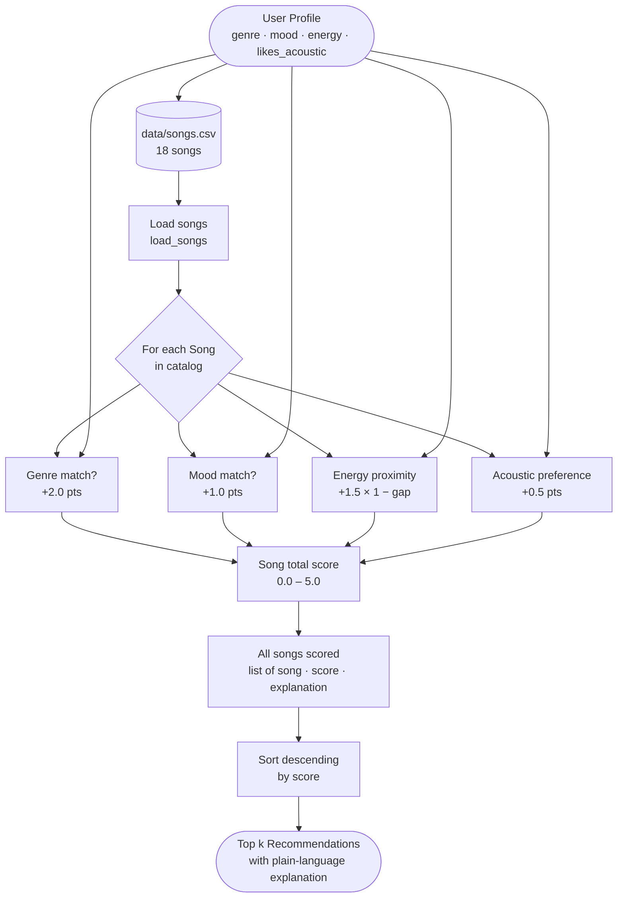

# 🎵 Music Recommender Simulation

## Project Summary

In this project you will build and explain a small music recommender system.

Your goal is to:

- Represent songs and a user "taste profile" as data
- Design a scoring rule that turns that data into recommendations
- Evaluate what your system gets right and wrong
- Reflect on how this mirrors real world AI recommenders

This simulation builds a content-based music recommender that scores songs by measuring how closely each song's audio features match a user's stated taste profile. Rather than learning from other users' behavior (collaborative filtering), this system compares song attributes directly — rewarding proximity to the user's preferred energy level, mood, and genre. The recommender ranks all songs in the catalog by their total weighted score and returns the top matches, making its reasoning fully transparent and inspectable.

---

## How The System Works

Real-world recommenders like Spotify blend two strategies: collaborative filtering (learning from what millions of users played and skipped) and content-based filtering (comparing audio features directly). This simulation focuses on the content-based approach — it scores every song by measuring how closely its attributes match a user's taste profile, then returns the top matches with a plain-language explanation of what drove each recommendation.

### `Song` Features

| Field | Type | Used in scoring |
|---|---|---|
| `genre` | str | Genre match bonus |
| `mood` | str | Mood match bonus |
| `energy` | float 0–1 | Proximity to `target_energy` (highest weight) |
| `valence` | float 0–1 | Proximity score — happy vs. melancholic |
| `tempo_bpm` | float | Proximity score — normalized before comparing |
| `danceability` | float 0–1 | Proximity score |
| `acousticness` | float 0–1 | Boosted or penalized by `likes_acoustic` flag |

### `UserProfile` Fields

| Field | Type | What it captures |
|---|---|---|
| `favorite_genre` | str | Preferred genre (e.g. `"lofi"`, `"pop"`) |
| `favorite_mood` | str | Desired vibe (e.g. `"chill"`, `"intense"`) |
| `target_energy` | float 0–1 | How energetic the user wants the music right now |
| `likes_acoustic` | bool | Organic/acoustic vs. electronic preference |

### Scoring and Ranking

Each song receives a weighted score: numeric features use `1 - |user_pref - song_value|` (closer = higher), while genre and mood add fixed categorical bonuses. The `Recommender` sorts all songs by descending score and returns the top `k` results.

---

### Data Flow



---

### Algorithm Recipe

| Rule | Points | Notes |
|---|---|---|
| Genre match | **+2.0** | Exact string match on `genre` field — highest weight because genre is the largest sonic gap in the catalog |
| Mood match | **+1.0** | Exact string match on `mood` — secondary to genre, can cross genre boundaries |
| Energy proximity | **+1.5 × (1 − \|target − song.energy\|)** | Continuous 0–1 feature; max 1.5 pts for a perfect match, 0 pts for opposite ends |
| Acoustic preference | **+0.5** | Bonus if `likes_acoustic=True` and `acousticness ≥ 0.6`, or `False` and `acousticness < 0.4` |
| **Max total** | **5.0** | Genre + mood + perfect energy + acoustic preference all satisfied |

**Example:** For `target_energy=0.82, genre=pop, mood=happy, likes_acoustic=False`:
- `Sunrise City` (pop, happy, energy=0.82, acousticness=0.18) → **5.00** — all four rules fire
- `Focus Flow` (lofi, chill, energy=0.40, acousticness=0.78) → **0.77** — no genre, no mood, weak energy, wrong acoustic

---

### Potential Biases

- **Genre dominance.** At +2.0, genre is 40% of the maximum score. A great song that matches mood, energy, and acoustic preference perfectly but has the wrong genre (e.g. an indie-pop track for a "pop" user) will lose to a poor genre-match song with little else in common. The genre weight may be too high for users whose taste crosses genre lines.
- **Catalog underrepresentation.** The 18-song catalog skews toward pop and lofi. A user whose favorite genre is `"r&b"` or `"reggae"` has only one matching song available, so the system is forced to fall back on numeric proximity for the rest of the top-5 — which may produce unexpected results.
- **Binary acoustic flag.** `likes_acoustic` is a boolean, but real listening preferences exist on a spectrum. A user who sometimes enjoys both acoustic and electronic music gets half the acoustic signal that a strongly-opinionated user does.
- **Energy as a stand-in for "vibe."** The system uses energy as the sole continuous numeric feature. Two songs at the same energy level (e.g. jazz at 0.37 and metal at 0.37) can feel completely different — mood and genre bonuses are the only thing separating them, and if neither matches, the system may surface the wrong one.

---

## Sample Terminal Output

Running `python -m src.main` with the default `pop / happy / energy 0.82` profile produces:

```
====================================================
   MUSIC RECOMMENDER SIMULATION
====================================================
  Catalog loaded : 18 songs
  Genre          : pop
  Mood           : happy
  Target energy  : 0.82
  Likes acoustic : False
====================================================
  Top 5 Recommendations
====================================================

  #1  Sunrise City  —  Neon Echo
       Score: 5.00 / 5.0  [####################]
       • genre match (+2.0)
       • mood match (+1.0)
       • energy proximity (+1.5)
       • electronic sound matches preference (+0.5)

  #2  Gym Hero  —  Max Pulse
       Score: 3.83 / 5.0  [###############-----]
       • genre match (+2.0)
       • energy proximity (+1.33)
       • electronic sound matches preference (+0.5)

  #3  Rooftop Lights  —  Indigo Parade
       Score: 2.91 / 5.0  [############--------]
       • mood match (+1.0)
       • energy proximity (+1.41)
       • electronic sound matches preference (+0.5)

  #4  Block Party Anthem  —  Krave
       Score: 1.92 / 5.0  [########------------]
       • energy proximity (+1.42)
       • electronic sound matches preference (+0.5)

  #5  Night Drive Loop  —  Neon Echo
       Score: 1.90 / 5.0  [########------------]
       • energy proximity (+1.4)
       • electronic sound matches preference (+0.5)

====================================================
```

**Why these results make sense for a `pop / happy` profile:**
- `Sunrise City` is the only song that hits all four rules — perfect score of 5.00
- `Gym Hero` loses only the mood bonus (mood=intense, not happy) — still a strong #2
- `Rooftop Lights` (indie pop) gains the mood bonus but not the genre bonus — lands at #3
- `Block Party Anthem` and `Night Drive Loop` have no genre/mood match but high energy and low acousticness keep them in the top 5 over chill/acoustic tracks

---

## Getting Started

### Setup

1. Create a virtual environment (optional but recommended):

   ```bash
   python -m venv .venv
   source .venv/bin/activate      # Mac or Linux
   .venv\Scripts\activate         # Windows

2. Install dependencies

```bash
pip install -r requirements.txt
```

3. Run the app:

```bash
python -m src.main
```

### Running Tests

Run the starter tests with:

```bash
pytest
```

You can add more tests in `tests/test_recommender.py`.

---

## Experiments You Tried

Use this section to document the experiments you ran. For example:

- What happened when you changed the weight on genre from 2.0 to 0.5
- What happened when you added tempo or valence to the score
- How did your system behave for different types of users

---

## Limitations and Risks

Summarize some limitations of your recommender.

Examples:

- It only works on a tiny catalog
- It does not understand lyrics or language
- It might over favor one genre or mood

You will go deeper on this in your model card.

---

## Reflection

Read and complete `model_card.md`:

[**Model Card**](model_card.md)

Write 1 to 2 paragraphs here about what you learned:

- about how recommenders turn data into predictions
- about where bias or unfairness could show up in systems like this


---

## 7. `model_card_template.md`

Combines reflection and model card framing from the Module 3 guidance. :contentReference[oaicite:2]{index=2}  

```markdown
# 🎧 Model Card - Music Recommender Simulation

## 1. Model Name

Give your recommender a name, for example:

> VibeFinder 1.0

---

## 2. Intended Use

- What is this system trying to do
- Who is it for

Example:

> This model suggests 3 to 5 songs from a small catalog based on a user's preferred genre, mood, and energy level. It is for classroom exploration only, not for real users.

---

## 3. How It Works (Short Explanation)

Describe your scoring logic in plain language.

- What features of each song does it consider
- What information about the user does it use
- How does it turn those into a number

Try to avoid code in this section, treat it like an explanation to a non programmer.

---

## 4. Data

Describe your dataset.

- How many songs are in `data/songs.csv`
- Did you add or remove any songs
- What kinds of genres or moods are represented
- Whose taste does this data mostly reflect

---

## 5. Strengths

Where does your recommender work well

You can think about:
- Situations where the top results "felt right"
- Particular user profiles it served well
- Simplicity or transparency benefits

---

## 6. Limitations and Bias

Where does your recommender struggle

Some prompts:
- Does it ignore some genres or moods
- Does it treat all users as if they have the same taste shape
- Is it biased toward high energy or one genre by default
- How could this be unfair if used in a real product

---

## 7. Evaluation

How did you check your system

Examples:
- You tried multiple user profiles and wrote down whether the results matched your expectations
- You compared your simulation to what a real app like Spotify or YouTube tends to recommend
- You wrote tests for your scoring logic

You do not need a numeric metric, but if you used one, explain what it measures.

---

## 8. Future Work

If you had more time, how would you improve this recommender

Examples:

- Add support for multiple users and "group vibe" recommendations
- Balance diversity of songs instead of always picking the closest match
- Use more features, like tempo ranges or lyric themes

---

## 9. Personal Reflection

A few sentences about what you learned:

- What surprised you about how your system behaved
- How did building this change how you think about real music recommenders
- Where do you think human judgment still matters, even if the model seems "smart"

